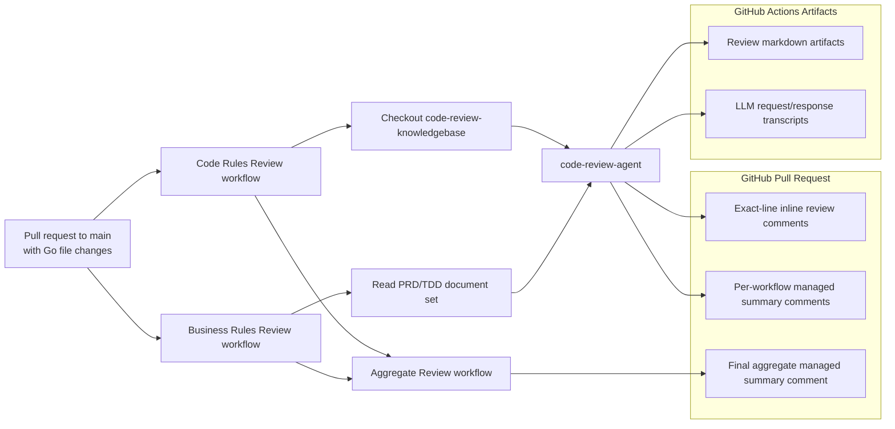
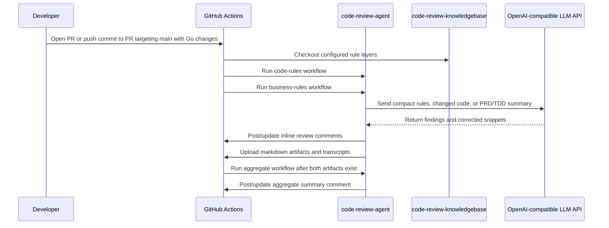

# Code Review Demo

Implementation repository for the intelligent code review CI/CD demo.

This repo owns the demo Go services, PRD/TD source documents, `.code-review.yml`, GitHub Actions workflows, and generated CI artifacts. The reusable review logic lives in `code-review-agent`; coding rules live in `code-review-knowledgebase`.

## Repository Role

- Provide realistic Go codebases for validating an automated PR review agent.
- Store PRD/TDD markdown documents used by the business-rule review pipeline.
- Configure knowledgebase layers and document sets through `.code-review.yml`.
- Run GitHub Actions workflows when a PR targets `main` and changes Go source files.
- Upload review outputs and LLM audit transcripts as CI artifacts.

## Demo Projects

| Project | Status | Complexity | Description | Stack |
| --- | --- | --- | --- | --- |
| `demo-projects/simple-api/` | Active | Beginner | Product catalog CRUD API | Go stdlib `net/http`, SQLite |
| `demo-projects/medium-api/` | Active | Intermediate | Order management API | Gin, PostgreSQL, Redis |
| `demo-projects/complex-api/` | On hold | Advanced | Marketplace platform API | Gin, PostgreSQL, Redis, NATS |

Each active project includes PRD, TDD, API docs, Postman collection, Docker files, tests, and environment examples.

## CI Review Architecture

## Workflow Flow

## Configuration

`.code-review.yml` defines:

- repository metadata: name, department, project, languages.
- knowledge layers: `common/go`, `demo/go`, `demo/demo-project/go`.
- disabled rule IDs for rules that intentionally do not apply.
- PRD/TDD document sets and related code paths.
- output paths for code-rule and business-rule artifacts.

## Review Modes

- `code-rules`: checks changed Go files against layered markdown coding rules.
- `business-rules`: summarizes affected PRD/TDD documents and checks implementation logic against the summary.
- `aggregate`: combines the code-rule and business-rule artifacts into one final managed PR summary.

Code-rule and business-rule workflows run in parallel. Both modes can post exact-line PR review comments. The aggregate workflow posts only a final summary comment.

## Credentials

The demo uses Alibaba Model Studio through the OpenAI-compatible API surface.

- `OPENAI_API_KEY`: GitHub repository secret.
- `OPENAI_BASE_URL`: GitHub repository variable, with workflow fallback to the Alibaba compatible endpoint.
- `OPENAI_MODEL`: GitHub repository variable naming the configured LLM model.
- `KNOWLEDGEBASE_REPO_TOKEN`: optional secret for checking out a private knowledgebase repo.

## Generated Artifacts

Generated files are ignored locally and uploaded by CI:

- `.code-review/artifacts/code-rules-review.md`
- `.code-review/artifacts/business-rules-review.md`
- `.code-review/artifacts/*-prd-td-summary.md`
- `.code-review/artifacts/aggregate-review.md`
- `output/*.md` provider request/response transcripts

## Future Improvements

- Export finding lifecycle events to an external Hive table for analysis.
- Track consumed findings when a later push changes the flagged code.
- Track stale, unresolved, and resolved generated comments.
- Add optional developer feedback signals such as upvote/downvote reactions.
- Build dashboards for rule effectiveness, false-positive rate, consumption rate, and non-consumption rate.
- Add project-management integration to fetch PRD/TD links from systems such as Jira instead of reading local markdown files.
- Promote or merge duplicate rules based on measured effectiveness across repositories.
