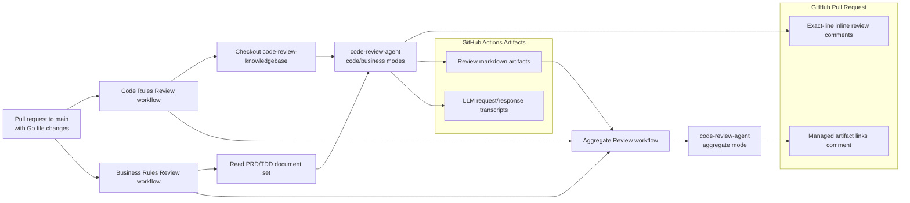
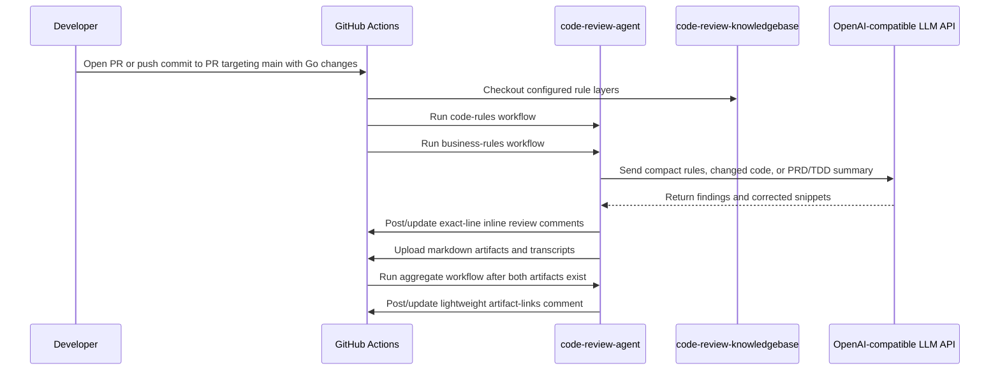

# Code Review Demo

Implementation repository for the intelligent code review CI/CD demo.

This repo owns the demo Go services, PRD/TD source documents, `.code-review.yml`, GitHub Actions workflows, and generated CI artifacts. The reusable review logic lives in `code-review-agent`; coding rules live in `code-review-knowledgebase`.

## Repository Role

- Provide realistic Go codebases for validating an automated PR review agent.
- Store PRD/TDD markdown documents used by the business-rule review pipeline.
- Configure knowledgebase layers and document sets through `.code-review.yml`.
- Run GitHub Actions workflows when a PR targets `main` and changes Go source files.
- Upload review outputs and LLM audit transcripts as CI artifacts.

## Demo Projects

| Project | Status | Complexity | Description | Stack |
| --- | --- | --- | --- | --- |
| `demo-projects/simple-api/` | Active | Beginner | Product catalog CRUD API | Go stdlib `net/http`, SQLite |
| `demo-projects/medium-api/` | Active | Intermediate | Order management API | Gin, PostgreSQL, Redis |
| `demo-projects/complex-api/` | On hold | Advanced | Marketplace platform API | Gin, PostgreSQL, Redis, NATS |

Each active project includes PRD, TDD, API docs, Postman collection, Docker files, tests, and environment examples.

## CI Review Architecture

## Workflow Flow

## Configuration

`.code-review.yml` defines:

- repository metadata: name, department, project, languages.
- knowledge layers: `common/go`, `demo/go`, `demo/demo-project/go`.
- disabled rule IDs for rules that intentionally do not apply.
- PRD/TDD document sets and related code paths.
- output paths for code-rule and business-rule artifacts.

## Review Modes

- `code-rules`: checks changed Go files against layered markdown coding rules.
- `business-rules`: summarizes affected PRD/TDD documents and checks implementation logic against the summary.
- `aggregate`: combines the code-rule and business-rule artifacts into an aggregate artifact, then posts one lightweight PR comment linking to the review artifacts.

Code-rule and business-rule workflows run in parallel. Both modes post exact-line PR review comments only. Full review markdown, PRD/TDD summaries, and LLM transcripts stay in GitHub Actions artifacts for debugging.

## Credentials

The demo uses Alibaba Model Studio through the OpenAI-compatible API surface.

- `OPENAI_API_KEY`: GitHub repository secret.
- `OPENAI_BASE_URL`: GitHub repository variable, with workflow fallback to the Alibaba compatible endpoint.
- `OPENAI_MODEL`: GitHub repository variable naming the configured LLM model.
- `KNOWLEDGEBASE_REPO_TOKEN`: optional secret for checking out a private knowledgebase repo.

## Generated Artifacts

Generated files are ignored locally and uploaded by CI:

- `.code-review/artifacts/code-rules-review.md`
- `.code-review/artifacts/business-rules-review.md`
- `.code-review/artifacts/*-prd-td-summary.md`
- `.code-review/artifacts/aggregate-review.md`
- `output/*.md` provider request/response transcripts

## Future Improvements

Detailed implementation plans live in the reusable agent repo: [code-review-agent/docs/future-improvements/README.md](https://github.com/laughingkid-sg/code-review-agent/blob/main/docs/future-improvements/README.md).

| ID | Improvement | Suggested Priority | Plan |
| --- | --- | --- | --- |
| FI-001 | Review filter stage for precision | P1 | [Implementation plan](https://github.com/laughingkid-sg/code-review-agent/blob/main/docs/future-improvements/README.md#fi-001-review-filter-stage-for-precision) |
| FI-002 | Diff-aware context preparation | P1 | [Implementation plan](https://github.com/laughingkid-sg/code-review-agent/blob/main/docs/future-improvements/README.md#fi-002-diff-aware-context-preparation) |
| FI-003 | Finding lifecycle artifacts | P1 | [Implementation plan](https://github.com/laughingkid-sg/code-review-agent/blob/main/docs/future-improvements/README.md#fi-003-finding-lifecycle-artifacts) |
| FI-004 | Aggregate summary from publish results | P1 | [Implementation plan](https://github.com/laughingkid-sg/code-review-agent/blob/main/docs/future-improvements/README.md#fi-004-aggregate-summary-from-publish-results) |
| FI-005 | Finding analytics export to Hive | P2 | [Implementation plan](https://github.com/laughingkid-sg/code-review-agent/blob/main/docs/future-improvements/README.md#fi-005-finding-analytics-export-to-hive) |
| FI-006 | Consumption and non-consumption metrics | P2 | [Implementation plan](https://github.com/laughingkid-sg/code-review-agent/blob/main/docs/future-improvements/README.md#fi-006-consumption-and-non-consumption-metrics) |
| FI-007 | Developer feedback signals | P2 | [Implementation plan](https://github.com/laughingkid-sg/code-review-agent/blob/main/docs/future-improvements/README.md#fi-007-developer-feedback-signals) |
| FI-008 | Rule effectiveness dashboard | P2 | [Implementation plan](https://github.com/laughingkid-sg/code-review-agent/blob/main/docs/future-improvements/README.md#fi-008-rule-effectiveness-dashboard) |
| FI-009 | Project-management document integration | P2 | [Implementation plan](https://github.com/laughingkid-sg/code-review-agent/blob/main/docs/future-improvements/README.md#fi-009-project-management-document-integration) |
| FI-010 | Versioned cross-repo contracts | P2 | [Implementation plan](https://github.com/laughingkid-sg/code-review-agent/blob/main/docs/future-improvements/README.md#fi-010-versioned-cross-repo-contracts) |
| FI-011 | Knowledgebase contribution guide | P2 | [Implementation plan](https://github.com/laughingkid-sg/code-review-agent/blob/main/docs/future-improvements/README.md#fi-011-knowledgebase-contribution-guide) |
| FI-012 | Rule duplicate detection and promotion | P2 | [Implementation plan](https://github.com/laughingkid-sg/code-review-agent/blob/main/docs/future-improvements/README.md#fi-012-rule-duplicate-detection-and-promotion) |
| FI-013 | Historical benchmark suite | P2 | [Implementation plan](https://github.com/laughingkid-sg/code-review-agent/blob/main/docs/future-improvements/README.md#fi-013-historical-benchmark-suite) |
| FI-014 | Governance operating playbook | P3 | [Implementation plan](https://github.com/laughingkid-sg/code-review-agent/blob/main/docs/future-improvements/README.md#fi-014-governance-operating-playbook) |
| FI-015 | Multi-language expansion | P3 | [Implementation plan](https://github.com/laughingkid-sg/code-review-agent/blob/main/docs/future-improvements/README.md#fi-015-multi-language-expansion) |
| FI-016 | Provider capability detection | P2 | [Implementation plan](https://github.com/laughingkid-sg/code-review-agent/blob/main/docs/future-improvements/README.md#fi-016-provider-capability-detection) |
| FI-017 | Optional developer notifications | P3 | [Implementation plan](https://github.com/laughingkid-sg/code-review-agent/blob/main/docs/future-improvements/README.md#fi-017-optional-developer-notifications) |
| FI-018 | Guided repair patch suggestions | P3 | [Implementation plan](https://github.com/laughingkid-sg/code-review-agent/blob/main/docs/future-improvements/README.md#fi-018-guided-repair-patch-suggestions) |
| FI-019 | Public-repo safety model | P2 | [Implementation plan](https://github.com/laughingkid-sg/code-review-agent/blob/main/docs/future-improvements/README.md#fi-019-public-repo-safety-model) |
| FI-020 | Category and taxonomy metadata | P3 | [Implementation plan](https://github.com/laughingkid-sg/code-review-agent/blob/main/docs/future-improvements/README.md#fi-020-category-and-taxonomy-metadata) |
